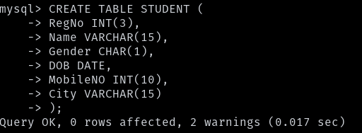
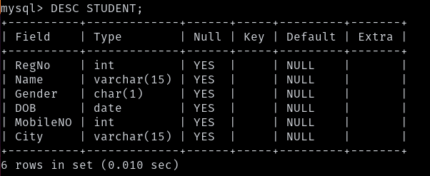
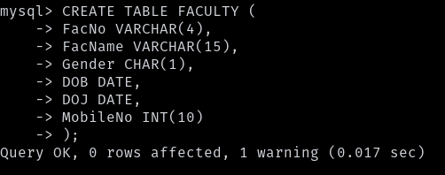
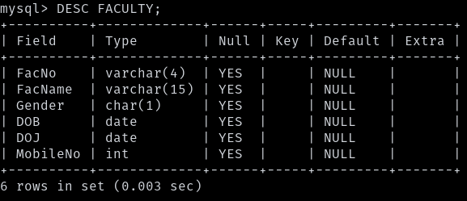
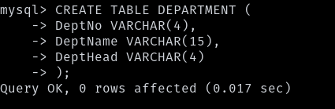
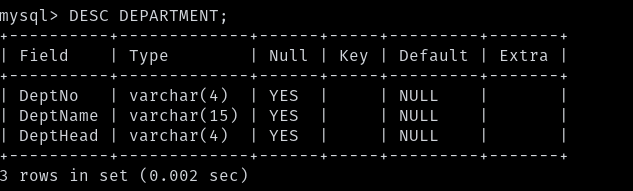
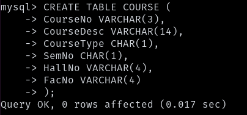
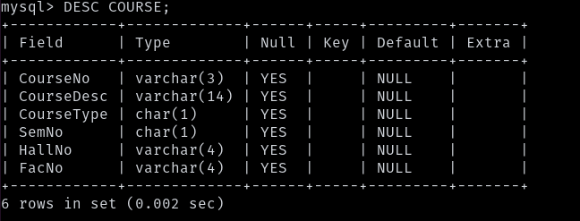
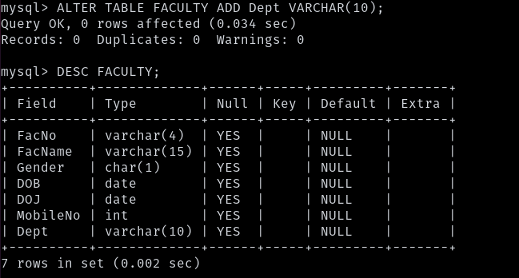

## 1) Create a table name STUDENT with following structure.

## 2) Create a table name FACULTY with following structure.

## 3) Create a table name DEPARTMENT with following structure.

## 4) Create a table name COURSE with following structure.

## 5) Modify the table FACULTY by adding a column name Dept of datatype VARCHAR(10)

