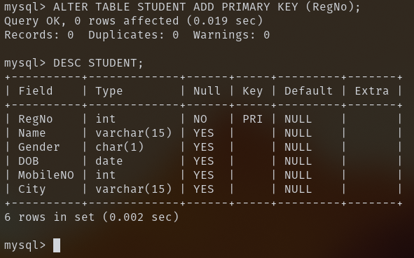
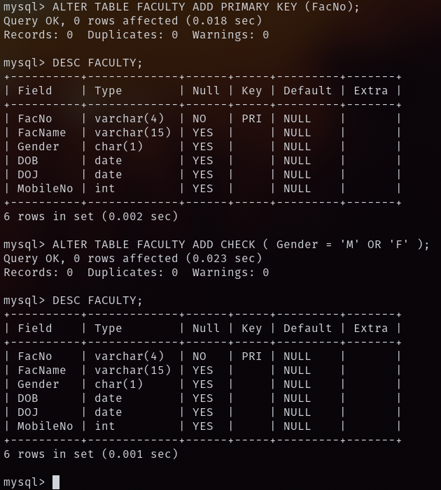
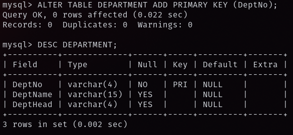
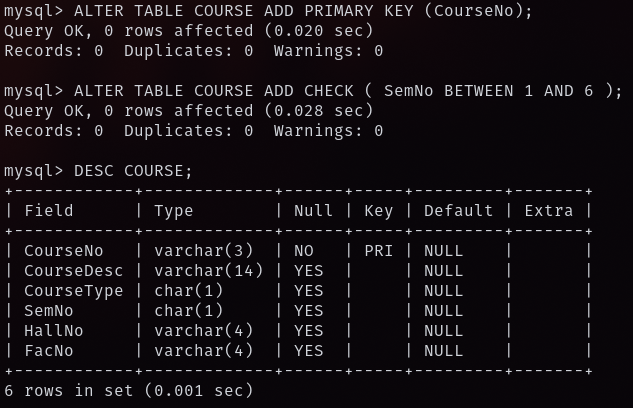
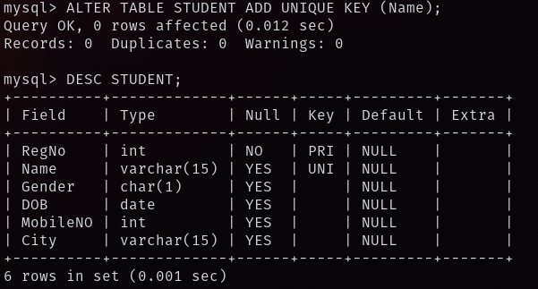
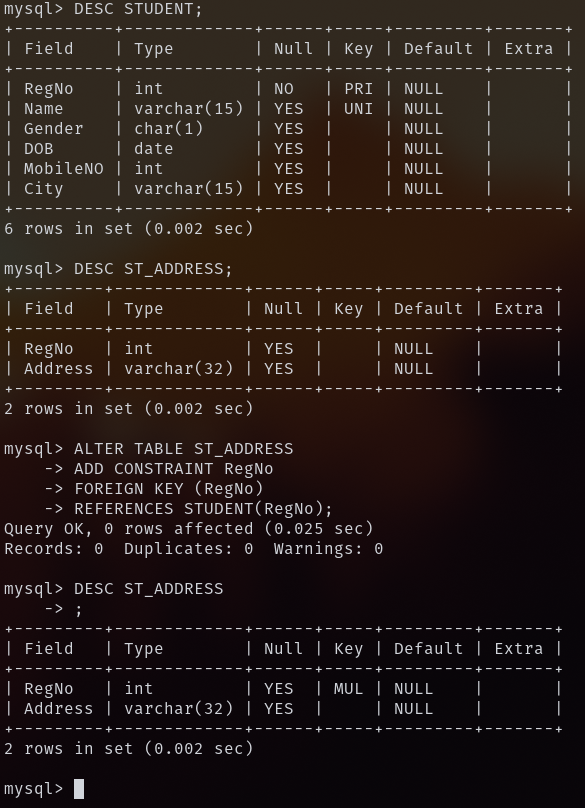

## 1) Alter the table STUDENT2 with following structure.

## 2) Alter the table name FACULTY with following structure.

## 3) Alter the table name DEPARTMENT with following structure.

## 4) Alter the table name COURSE with following structure.

## 5) Alter the table name STUDENT2 with following structure.

## 6) After the STUDENT2 & STUDENT3 tables are successfully created, test if you can add a constraint FOREIGN KEY to the RegNo of this table.

