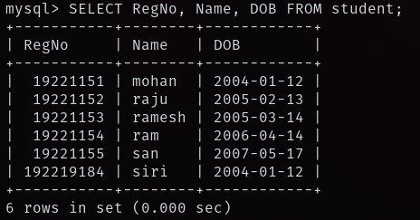
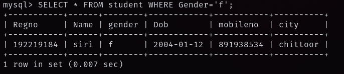
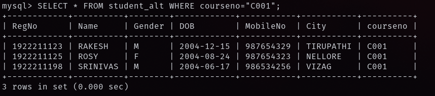
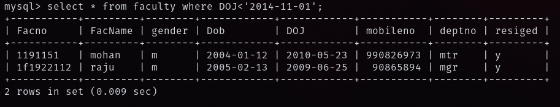
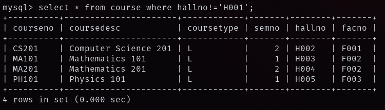
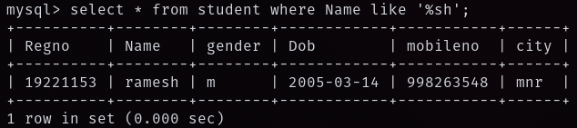
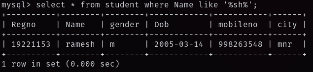
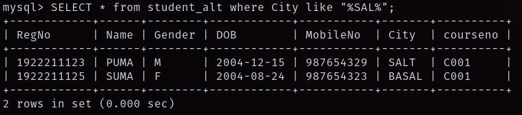
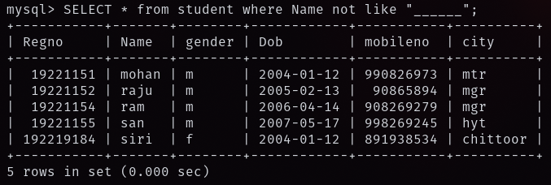
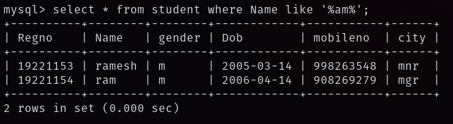

## 1) The student counselor wanted to display the registration number, student name and date of birth for all the students.

## 2) The controller of examinations wanted to list all the female students.

## 3) List the Students who registered for the "C001" course.

## 4) Display all faculty details joined before "November 2014".

## 5) Display all the courses not allotted to hall 'H001'.

## 6) List the students whose name ends with the substring "sh".

## 7) Display all students whose name contains the substring "sh".

## 8) Find all the students who are located in cities having "Sal" as substring.

## 9) Display the students whose names do not contain six letters.

## 10) Find all the students whose names contains "am".

